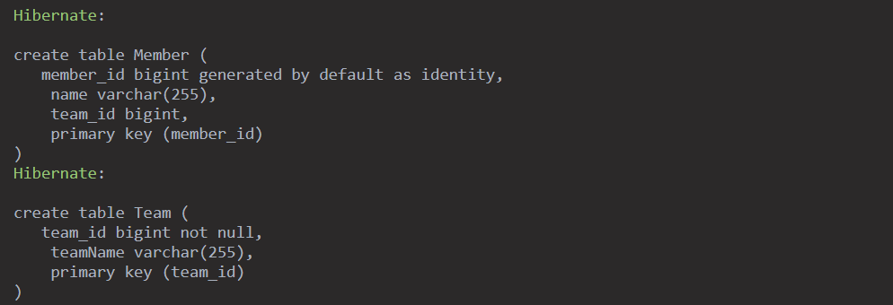
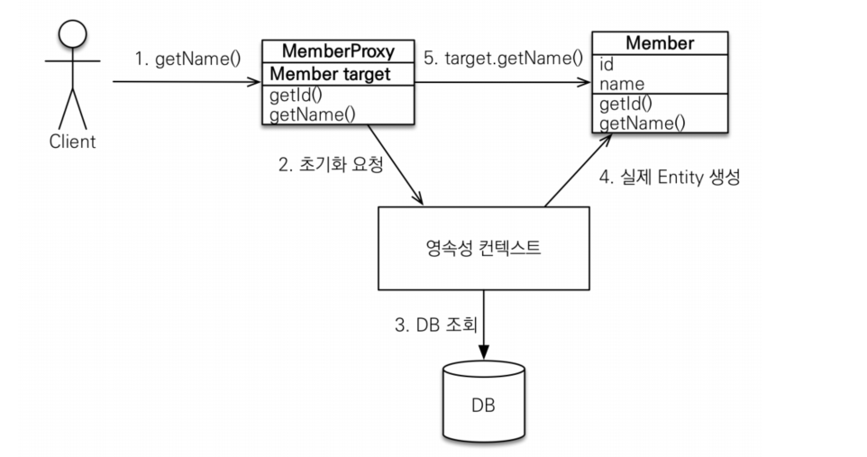
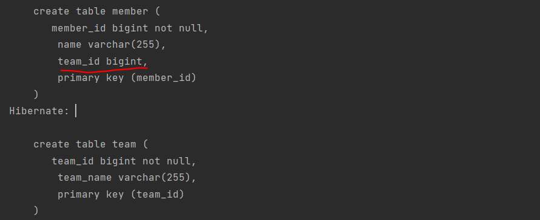

# OneToOne 지연로딩

## OneToOne 관계는 과연 지연로딩이 되는가

## 목차
1. JPA 연관관계 매핑 - @OneToOne
2. JPA 프록시
3. 즉시로딩과 지연로딩이란?
4. OneToOne 은 즉시로딩인가 지연로딩인가

## 1. JPA 연관관계 매핑 - @OneToOne

- JPA에서 단방향 매핑은 `@JoinColumn과` `@OneToOne` 를 통해 할 수 있다.

```java

@Entity(name = "Team")
@Getter
@NoArgsConstructor(access = AccessLevel.PROTECTED)
public class Team {
    @Id
    @GeneratedValue(strategy = GenerationType.AUTO)
    @Column(name = "team_id")
    private Long id;

    private String teamName;
}
```

```java

@Entity(name = "Member")
@Getter
@NoArgsConstructor
public class Member {
    @Id
    @GeneratedValue(strategy = GenerationType.AUTO)
    @Column(name = "member_id")
    private Long id;

    private String name;

    @OneToOne
    @JoinColumn(name = "team_id")
    private Team team;
}
```



- 양방향 매핑은 Team Class에 Member를 추가하고 mappedBy를 통해 맺을 수 있다.
- 연관관계는 단방향 매핑으로 다 맺어진것이다.
- 객체 그래프 탐색을 위해 추가 설정을 하는 것이다.
- OneToOne 의 경우 연관관계 주인은 편한 곳으로 지정하면 된다.
- 연관관계의 주인 쪽에서 `@JoinColumn` 을 통해 관계를 맺고 반대쪽은 `mappedBy` 속성을 사용하여 관계를 맺으면 된다.

```java
    @OneToOne(mappedBy = "team")
private Member member;
```

## 2. JPA 프록시

> 어떤 A와 B가 연관관계가 있을 때 A를 호출할 때 항상 B도 함께 호출되면 효율적이지 못하다. 이럴 때 프록시를 활용하여 문제를 해결할 수 있다.

- 프록시 객체를 초기화할 때, 프록시 객체가 실제 엔티티로 바뀌는 게 아닌 프록시를 통해 실제 엔티티에 접근하는 것
- 즉 프록시 객페를 가지고 있다가 실제 값이 호출 될때 db 에서 데이터를 가지고 온다.
- 영속성 콘텍스트에 이미 실제 엔티티가 있으면 getReference를 하여도 실제 엔티티가 조회된다.
- 준영속 상태에서 프록시를 통해 값을 가져오려고 하면 에러가 발생한다.



1) Client가 getName()을 호출한다.
2) 호출받은 프록시가영속성 콘텍스트에 초기화를 요청한다.
3) 영속성 콘텍스트에 이미 값이 있다면 바로 4번으로 갈 테지만 그렇지 않다면 DB에 조회한다.
4) 조회된 데이터로 실제 엔티티를 생성한다.
5) 생성된 실제 엔티티를 프록시가 조회하여 반환해준다.

```java
System.out.println("=================== 호출 전 ===================");
        System.out.println("findMember.getClass() = "+findMember.getClass());

        System.out.println("findMember.getName() 첫번째 호출 = "+findMember.getName());
        System.out.println("findMember.getName() 두번째 호출 = "+findMember.getName());
        System.out.println("=================== 호출 후 ===================");
```

```java
===================호출 전===================
        findMember.getClass()=

class blogJpa.Member$HibernateProxy$PnhnxVd7
        Hibernate:
        select
        생략...
        from
        Member member0_
        left outer join
        Team team1_
        on member0_.team_id=team1_.team_id
        where
        member0_.member_id=?
        findMember.getName()첫번째 호출=Dexter
        findMember.getName()두번째 호출=Dexter
        ===================호출 후===================
```

## 3. 즉시로딩과 지연로딩이란?

> 즉시 로딩이란 객체 A를 조회할 때 A와 연관된 객체들을 한 번에 가져오는 것이다.
> 지연 로딩이란 객체 A를 조회할 때는 A만 가져오고 연관된 애들은 프록시 초기화 방법으로 가져온다.

### EAGER, LAZY

@ManyToOne, @OneToOne : 기본값이 즉시 로딩 @OneToMany, @ManyToMany : 기본값이 지연 로딩

### 즉시 로딩의 성능과 문제점

- 관련된 모든 객체를 한번에 db 에서 가져오기 때문에 편하게 느껴진다.
- 실제 엔티티의 연관관계가 깊어지면 즉시 로딩이 연관된 모든 엔티티들을 조회하게 된다.
- 그 엔티티들을 조회할 때 따로따로 조회하므로 N + 1문제 가 발생한다.
- 결론적으로 가급적 모든 관계는 지연 로딩으로 설정해야 한다

```java
@ManyToOne(fetch = FetchType.EAGER)
@JoinColumn(name = "team_id")
private Team team;
```
```java
Team team1=new Team();
team1.setTeamName("team1");
em.persist(team1);

Team team2=new Team();
team2.setTeamName("team2");
em.persist(team2);

Member m1=new Member();
m1.setName("Dexter");
m1.setTeam(team1);
em.persist(m1);

Member m2=new Member();
m2.setName("James");
m2.setTeam(team2);
em.persist(m2);

em.flush();
em.clear();

List<Member> members = em.createQuery("select m from Member m", Member.class)
        .getResultList();
```
- SQL 을 확인하면 Member 은 한번에 가져오지만 team 은 가져올 때 마다 쿼리를 따로따로 날리는 것을 알 수 있다.
- 만약 Member가 1개 있고, 100개의 팀에 그 멤버가 존재한다면 Member 을 select 할 시 총 101개의 쿼리문이 나가게 된다.
- 지연 로딩도 n+1 문제가 존재하지만 fetch join 을 통해 한번에 데이터를 가져 올수 있다.
- 
[성현님의 블로그를 참고해 주세요]

## 4. OneToOne 은 즉시로딩인가 지연로딩인가
> 우리는 앞에서 @OneToOne 은 기본값이 즉시 로딩이고 즉시 로딩의 N+1 등의 문제들을 페치조인으로 회피하기 위해 지연로딩을 권장한다고 하였다. 그렇다면 이질문을 한 이유가 무엇일까?

> 결론적으로 말하면 OneToOne 은 양방향 매핑의 경우 지연로딩이 적용되지 않는 문제가 존재한다.

- `@OneToOne` 은 즉시 로딩이다.
- FetchType을 LAZY로 변경해서 쓰기를 추천한다
- 단방향 `@OneToOne` 관계에서는 지연로딩 적용에 문제가 없다
- 양방향 `@OneToOne` 관계에서는 FetchType을 Lazy로 설정하더라도 Eager로 동작하는 경우가 있다.
- 정확하게 말하면 **`@OneToOne` 양방향 연관 관계에서 연관 관계의 주인이 아닌 쪽 엔티티를 조회할 때, Lazy로 동작할 수 없다.**

### 테스트 코드
```java

@Entity(name = "Member")
@Getter
@Setter
@NoArgsConstructor
public class Member {
    @Id
    @GeneratedValue(strategy = GenerationType.AUTO)
    @Column(name = "member_id")
    private Long id;

    private String name;

    @OneToOne(fetch = FetchType.LAZY)
    @JoinColumn(name = "team_id")
    private Team team;

    public void setTeam(Team team) {
        team.setMember(this);
        this.team = team;
    }
}

```
```java

@Entity(name = "Team")
@Getter
@Setter
@NoArgsConstructor
public class Team {
    @Id
    @GeneratedValue(strategy = GenerationType.AUTO)
    @Column(name = "team_id")
    private Long id;

    private String teamName;

    @OneToOne(fetch = FetchType.LAZY, mappedBy = "team")
    private Member member;

    public void setMember(Member member) {
        this.member = member;
    }
}

```


### 원인분석
1. 지연(LAZY)로딩을 사용하기 위해서는 JPA 구현체에서 "프록시를 만들어 주어야 한다."
- 전제 조건이 하나 더 있다.
- JPA 구현체는 연관 관계 엔티티에 **null 또는 프로시 객체**가 할당되어야만 한다.
2. `@OneToOne` 에서 null 은 연관 관계 해당 엔티티가 없는 것을 의미하고, 프록시 객체는 연관관계 해당 엔티티가 존재한다 볼 수 있다.
   - One-To-One 에서는 Lazy Loading이 잘 작동하지 않는다.
     - 이유는 null 값이 가능한 OneToOne의 경우(optional=true 상황) 프록시 객체로 감쌀 수 없기 때문이다. 
     - 만약 null 값이 가능한 OneToOne 에 프록시 객체를 넣는다면, 이미 그 순간 결코 null 이 아닌 프록시 객체를 리턴하는 상태가 돼 버리기 때문이다. 
     - 따라서 JPA 구현체는 기본적으로 One-To-One 관계에 Lazy 를 허용하지 않고, 즉시 값을 읽어 들인다.
> optional: 데이터가 필수적(not null)인지, 아닌지(null) 여부 ( default: true )
3. DB 관점에서 연관관계 주인인 엔티티에 매핑된 테이블에는 연결된 엔티티의 존재를 알 수 있는 컬럼이 존재한다.

4. null 이 있으면 연관 엔티티가 없는것 이고, null 이 아니면 프록시 객체 설정이 가능하여 LAZY 처리가 가능한다.

5. 반대로 연관관계 주인이 아닌 테이블에서는 컬럼 자체가 존재하지 않는다. 즉 해당 테이블만 읽어서는 연관관계 엔티티 존재 여부를 알 수 없다.
6. 이런 경우 값이 있는지 없는 지 알 수 없기 때문에 null 을 넣기도 애매하고 null 이 아니라는전제가 없기 때문에 프록시를 만들기도 애매하다.
- (프록시로 만들고 LAZY 로딩을 하니 데이터가 없어 null 을 리턴하겠다 이런 방식은 불가)
- 또한 2번에서 언급했듯이 null 을 프록시로 감싸버리면 null 이 아닌 프록시 객체상태로 리턴하게 됨으로 null 값 처리가 불가능해진다.
7. 따라서 **`@OneToOne` 양방향 연관 관계에서 연관 관계의 주인이 아닌 쪽 엔티티를 조회할 때, Lazy로 동작할 수 없다.**

### @OneToMany 는 괜찮은가?
1. 연관관계의 주인은 외래키를 관리하는 Many 쪽이다
2. One 쪽에서는 다의 존재를 알 수 있는 방법이 없다.
3. 하지만 Many 를 컬렉션으로 관리하기 때문에 null 을 표현할 방법이 있다(size).
4. 무조건 프로시 객체를 만들어 놓고 조회시 빈 컬렉션을 리턴하면 표현이 가능하다.
- (null 을 리턴하지 않고 null 과 같이 연관 관계가 없음을 표현할 size=0 이 존재하기 때문)

### @ManyToOne 는 괜찮은가?
1. Many 쪽은 컬럼 존재를 알 수 있기 때문에 처리 가능하다

### @OneToOne 지연로딩 문제 해결책
1. optional=false 설정을 통해 무조건 Lazy Loading 을 시킨다. 이를 통해 반드시 연관 시 값이 존재함이 보장되어야 한다.
   1.  PrimaryKeyJoin 의 경우에는 optional=false 일 경우에 데이터 저장 순서가 꼬여버린다. 정상적인 optional=false가 작동하려면 ForeignKey Join을 해야한다.
2. fetch join 으로 같이 가져와 해결 가능
3. 억지로 엔티티에 FK 롤 집어 넣어 해결
4. @ElementCollection 을 통해 컬렉션을 사용하고 unique 조건으로 데이터가 오직 1개만 들어가게 만든다.
5. OneToOne -> OneToMany + ManyToOne 분리 방법(좋은 방법은 아닌거 같다)


[참고 사이트]<br>
https://jeong-pro.tistory.com/249<br>
https://kwonnam.pe.kr/wiki/java/jpa/one-to-one